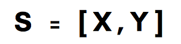
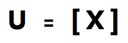
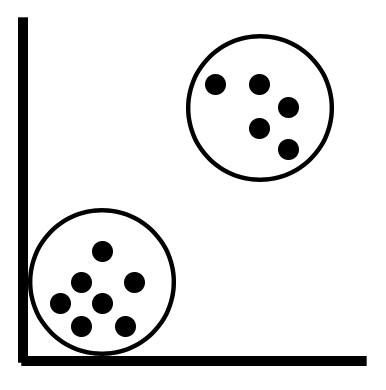

Lab 1. Introducing Machine Learning with scikit-learn
---------------------------------------------------------

Welcome to the world of machine learning with scikit-learn. I'm thrilled
that you have chosen this course in order to begin or further advance your
knowledge on the vast field of machine learning. Machine learning can be
overwhelming at times and this is partly due to the large number of
tools that are available on the market. This course will simplify this
process of tool selection down to one – scikit-learn. 

If I were to tell you what this course can do for you in one sentence, it
would be this –

> *The course gives you pipelines that can be implemented in order to solve a wide range of machine learning problems*.


A brief introduction to machine learning
----------------------------------------

* * * * *

Machine learning has generated quite the buzz – from Elon Musk fearing
the role of unregulated artificial intelligence in society, to Mark
Zuckerberg having a view that contradicts Musk's. 

So, what exactly is machine learning? Simply put, machine learning is a
set of **methods** that can detect patterns in data and use those patterns
to make future predictions. Machine learning has found immense value in
a wide range of industries, ranging from finance to healthcare. This
translates to a higher requirement of talent with the skill capital in
the field of machine learning. 

Broadly speaking, machine learning can be categorized into three main
types:

-   Supervised learning
-   Unsupervised learning
-   Reinforcement learning

Scikit-learn is designed to tackle problems pertaining to supervised and
unsupervised learning only, and does not support reinforcement learning
at present. 

### Supervised learning

Supervised learning is a form of machine learning in which our data
comes with a set of labels or a target variable that is numeric. These
labels/categories usually belong to one feature/attribute, which is
commonly known as the **target variable. **For instance, each row of
your data could either belong to the category of *Healthy* or *Not
Healthy*.

Given a set of features such as weight, blood sugar levels, and age, we
can use the supervised machine learning algorithm to predict whether the
person is healthy or not. 

In the following simple mathematical expression, **S** is the supervised
learning algorithm, **X** is the set of input features, such as weight
and age, and **Y** is the target variable with the labels *Healthy* or
*Not Healthy*:



Although supervised machine learning is the most common type of machine
learning that is implemented with scikit-learn and in the industry, most
datasets typically do not come with predefined labels. Unsupervised
learning algorithms are first used to cluster data without labels into
distinct groups to which we can then assign labels. This is discussed in
detail in the following section.

### Unsupervised learning

Unsupervised learning is a form of machine learning in which the
algorithm tries to detect/find patterns in data that do not have an
outcome/target variable. In other words, we do not have data that comes
with pre-existing labels. Thus, the algorithm will typically use a
metric such as distance to group data together depending on how close
they are to each other. 

As discussed in the previous section, most of the data that you will
encounter in the real world will not come with a set of predefined
labels and, as such, will only have a set of input features without a
target attribute. 

In the following simple mathematical expression, **U** is the
unsupervised learning algorithm, while **X** is a set of input features,
such as weight and age:



Given this data, our objective is to create groups that could
potentially be labeled as *Healthy* or *Not Healthy*. The unsupervised
learning algorithm will use a metric such as distance in order to
identify how close a set of points are to each other and how far apart
two such groups are. The algorithm will then proceed to cluster these
groups into two distinct groups, as illustrated in the following
diagram:



Clustering two groups together 


What is scikit-learn?
---------------------

* * * * *

Scikit-learn is a free and open source software that helps you tackle
supervised and unsupervised machine learning problems. The software is
built entirely in Python and utilizes some of the most popular libraries
that Python has to offer, namely NumPy and SciPy. 


The main reason why scikit-learn is very popular stems from the fact
that most of the world's most popular machine learning algorithms can be
implemented quite quickly in a plug and play format once you know what
the core pipeline is like. Another reason is that popular algorithms for
classification such as **logistic regression** and **support vector
machines** are written in Cython. Cython is used to give these
algorithms *C-like* performance and thus makes the use of scikit-learn
quite efficient in the process. 


Installing scikit-learn
-----------------------

* * * * *

There are two ways in which you can install scikit-learn on your
personal device:

-   By using the pip method
-   By using the Anaconda method

The pip method can be implemented on the macOS/Linux Terminal or the
Windows PowerShell, while the Anaconda method will work with the
Anaconda prompt.

Choosing between these two methods of installation is pretty
straightforward:

-   If you would like all the common Python package distributions for
    data science to be installed in one environment, the Anaconda method
    works best
-   If you would like to build you own environment from scratch for
    scikit-learn, the pip method works best (for advanced users of
    Python)

### Note

This course will be using Python 3.6 for all the code that is displayed
throughout every lab, unless mentioned otherwise.

**Note:** All python packages mentioned below have been installed already. It is not required to run commands below to install packages.

### The pip method

Scikit-learn requires a few packages to be installed on your device
before you can install it. These are as follows:

-   **NumPy**: Version 1.8.2 or greater
-   **SciPy**: Version 0.13.3 or greater


**Note:** Terminal is already running. You can also open new terminal by clicking: 

`File` > `New` > `Terminal`.

These can be installed using the pip method by using the following
commands:

```
sudo pip install NumPy
```

```
sudo pip install SciPy
```

Next, we can install scikit-learn using the following code:

```
sudo pip install scikit-learn
```

Additionally, if you already have scikit-learn installed on your device
and you simply want to upgrade it to the latest version, you can use the
following code:

```
sudo pip install -U scikit-learn
```

### Note

The version of scikit-learn implemented in the course is 0.19.1.

### The Anaconda method

In the event that you have installed Python using the Anaconda
distribution, you can install scikit-learn by using the following code
in the Anaconda prompt:

The first step is to install the dependencies:

```
sudo conda install -y  NumPy
```

```
sudo conda install -y  SciPy
```

Next, we can install scikit-learn by using the following code:

```
sudo conda install -y  scikit-learn
```

Additionally, if you already have scikit-learn installed with the
Anaconda distribution, you can upgrade it to the latest version by using
the following code in the Anaconda prompt:

```
conda update scikit-learn
```

### Note

When upgrading or uninstalling scikit-learn that has been installed with
Anaconda, avoid using the pip method at all costs as doing so is most
likely going to fail upgrading or removing all the required files. Stick
with either the pip method or the Anaconda method in order to maintain
consistency. 

### Additional packages

In this section, we will talk about the packages that we will be
installing outside of scikit-learn that will be used throughout this
course.

#### Pandas

To install Pandas, you can use either the pip method or the Anaconda
method, as follows:

Pip method:

```
sudo pip install pandas
```

Anaconda method:

```
sudo conda install -y  pandas
```

#### Matplotlib

To install matplotlib, you can use either the pip method or the Anaconda
method, as follows:

Pip method:

```
sudo pip install matplotlib
```

Anaconda method:

```
sudo conda install -y  matplotlib
```

#### Tree

To install tree, you can use either the pip method or the Anaconda
method, as follows:

Pip method:

```
sudo pip install tree
```

Anaconda method:

```
sudo conda install -y  tree
```

#### Pydotplus

To install pydotplus, you can use either the pip method or the Anaconda
method, as follows:

Pip method:

```
sudo pip install pydotplus
```

Anaconda method:

```
sudo conda install -y  pydotplus
```

#### Image

To install Image, you can use either the pip method or the Anaconda
method, as follows:

Pip method:

```
sudo pip install Image
```

Anaconda method:

```
sudo conda install -y  Image
```


Algorithms that you will learn to implement using scikit-learn
--------------------------------------------------------------

* * * * *

The algorithms that you will learn about in this course are broadly
classified into the following two categories:

-   Supervised learning algorithms 
-   Unsupervised learning algorithms 

 

### Supervised learning algorithms

Supervised learning algorithms can be used to solve both classification
and regression problems. In this course, you will learn how to implement
some of the most popular supervised machine learning algorithms. Popular
supervised machine learning algorithms are the ones that are widely used
in industry and research, and have helped us solve a wide range of
problems across a wide range of domains. These supervised learning
algorithms are as follows:

-   **Linear****regression**: This supervised learning algorithm is used
    to predict continuous numeric outcomes such as house prices, stock
    prices, and temperature, to name a few
-   **Logistic regression**: The logistic learning algorithm is a
    popular classification algorithm that is especially used in the
    credit industry in order to predict loan defaults
-   **k-Nearest Neighbors**: The k-NN algorithm is a classification
    algorithm that is used to classify data into two or more categories,
    and is widely used to classify houses into expensive and affordable
    categories based on price, area, bedrooms, and a whole range of
    other features
-   **Support vector machines**: The SVM algorithm is a popular
    classification algorithm that is used in image and face detection,
    along with applications such as handwriting recognition
-   **Tree-Based algorithms**: Tree-based algorithms such as decision
    trees, Random Forests, and Boosted trees are used to solve both
    classification and regression problems
-   **Naive Bayes**: The Naive Bayes classifier is a machine learning
    algorithm that uses the mathematical model of probability to solve
    classification problems

### Unsupervised learning algorithms

Unsupervised machine learning algorithms are typically used to cluster
points of data based on distance. The unsupervised learning algorithm
that you will learn about in this course is as follows:

-   **k-means**: The k-means algorithm is a popular algorithm that
    is typically used to segment customers into unique categories based
    on a variety of features, such as their spending habits. This
    algorithm is also used to segment houses into categories based on
    their features, such as price and area. 

 

Summary
-------

* * * * *

This lab has given you a brief introduction into what machine
learning is for those of you who are just beginning your journey into
the world of machine learning. You have learned about how scikit-learn
fits into the context of machine learning and how you can go about
installing the necessary software. 

Finally, you had a brief glimpse at all the algorithms that you will
learn to implement as you progress through this course, as well as its
associated applications in the real world. 

In the next lab, you will learn how to implement your first
algorithm – the K-Nearest Neighbors algorithm! 

