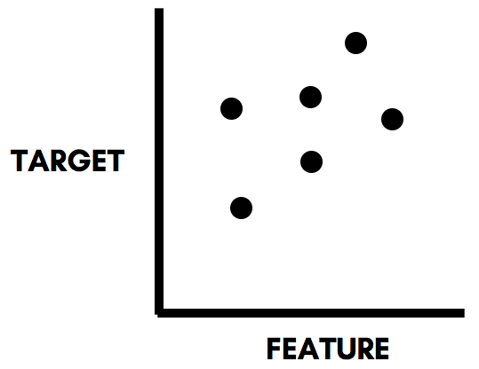
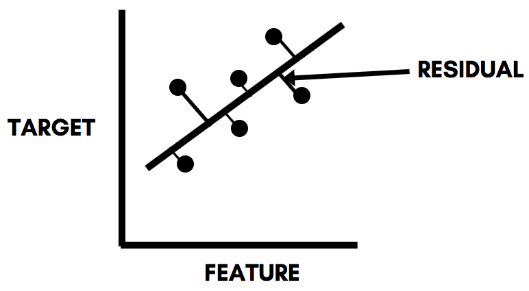
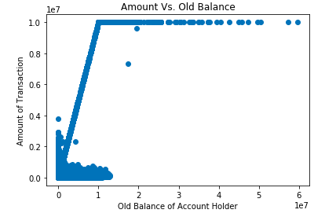
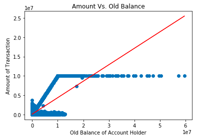
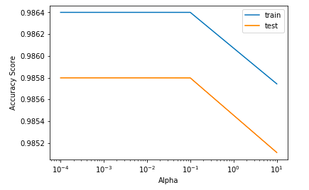
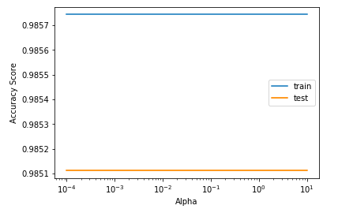

 Lab 5. Predicting Numeric Outcomes with Linear Regression
-------------------------------------------------------------

graph\_from\_dot\_data() function on the Linear regression is used to
predict a continuous numeric value from a set of input features. This
machine learning algorithm is fundamental to statisticians when it comes
to predicting numeric outcomes. Although advanced algorithms such as
neural networks and deep learning have taken the place of linear
regression in modern times, the algorithm is still key when it comes to
providing you with the foundations for neural networks and deep
learning. 

The key benefit of building machine learning models with the linear
regression algorithm, as opposed to neural networks and deep learning,
is that it is highly interpretable. Interpretability helps you, as the
machine learning practitioner, to understand how the different input
variables behave when it comes to predicting output. 

The linear regression algorithm is applied in the financial industry (in
order to predict stock prices) and in the real estate industry (in order
to predict housing prices). In fact, the linear regression algorithm can
be applied in any field where there is a need to predict a numeric
value, given a set of input features.

In this lab, you will learn about the following topics:
s
-   The inner mechanics of the linear regression algorithm
-   Building and evaluating your first linear regression algorithm,
    using scikit-learn
-   Scaling your data for a potential performance improvement
-   Optimizing your linear regression model


Technical requirements
----------------------

* * * * *

You will be required to have Python 3.6 or greater, Pandas ≥
0.23.4, Scikit-learn ≥ 0.20.0, and Matplotlib ≥ 3.0.0 installed on your
system.


The inner mechanics of the linear regression algorithm
------------------------------------------------------

* * * * *

In its most fundamental form, the expression for the linear regression
algorithm can be written as follows:

**

**

In the preceding equation, the output of the model is a numeric outcome.
In order to obtain this numeric outcome, we require that each input
feature be multiplied with a parameter called *Parameter1*, and we add
the second parameter, *Parameter2*, to this result. 

So, in other words, our task is to find the values of the two parameters
that can predict the value of the numeric outcome as accurately as
possible. In visual terms, consider the following diagram:



Two-dimensional plot between the target and input feature

The preceding diagram shows a two-dimensional plot between the target
that we want to predict on the *y *axis (numeric output) and the input
feature, which is along the *x *axis. The goal of linear regression is
to find the optimal values of the two parameters mentioned in the
preceding equation, in order to fit a line through the given set of
points.

This line is known as the **line of best fit**. A line of best fit is
one that fits the given sets of points very well, so that it can make
accurate predictions for us. Therefore, in order to find the optimal
values of the parameters that will result in the line of best fit, we
need to define a function that can do it for us. 

This function is known as the **loss function**. The goal of the loss
function, as the name suggests, is to minimize the loss/errors as much
as possible, so that we can obtain a line of best fit. In order to
understand how this works, consider the following diagram:



Line of best fit

In the preceding diagram, the line is fit through the set of data
points, and the features can be defined as follows:

-   The distance between each point in the plot and the line is known as
    the **residual**. 
-   The loss/error function is the sum of the squares of these
    residuals. 
-   The goal of the linear regression algorithm is to minimize this
    value. The sum of the squares of the residuals is known
    as **ordinary least squares **(**OLS**).


Implementing linear regression in scikit-learn
----------------------------------------------

* * * * *

In this section, you will implement your first linear regression
algorithm in scikit-learn. To make this easy to follow, the section will
be divided into three subsections, in which you will learn about the
following topics:

-   Implementing and visualizing a simple linear regression model in two
    dimensions 
-   Implementing linear regression to predict the mobile transaction
    amount 
-   Scaling your data for a potential increase in performance 

### Linear regression in two dimensions 

In this subsection, you will learn how to implement your first linear
regression algorithm, in order to predict the amount of a mobile
transaction by using one input feature: the old balance amount of the
account holder. We will be using the same fraudulent mobile transaction
dataset that we used in earlier lab, *Predicting
Categories with K-Nearest Neighbors*, of this course.

The first step is to read in the dataset and define the feature and
target variable. This can be done by using the following code:

```
import pandas as pd

#Reading in the dataset

df = pd.read_csv('fraud_prediction.csv')

#Define the feature and target arrays

feature = df['oldbalanceOrg'].values
target = df['amount'].values
```

Next, we will create a simple scatter plot between the amount of the
mobile transaction on the *y *axis (which is the outcome of the linear
regression model) and the old balance of the account holder along the
*x *axis (which is the input feature). This can be done by using the
following code:

```
import matplotlib.pyplot as plt

#Creating a scatter plot

plt.scatter(feature, target)
plt.xlabel('Old Balance of Account Holder')
plt.ylabel('Amount of Transaction')
plt.title('Amount Vs. Old Balance')
plt.show()
```

In the preceding code, we use the `plt.scatter()` function to
create a scatter plot between the feature* *on the *x *axis and
the target* *on the *y *axis. This results in the scatter plot
illustrated in the following diagram:



Two-dimensional space of the linear regression model

Now, we will fit a linear regression model into the two-dimensional
space illustrated in the preceding diagram. Note that, in the preceding
diagram, the data is not entirely linear. In order to do this, we use
the following code:

```
#Initializing a linear regression model 

linear_reg = linear_model.LinearRegression()

#Reshaping the array since we only have a single feature

feature = feature.reshape(-1, 1)
target = target.reshape(-1, 1)

#Fitting the model on the data

linear_reg.fit(feature, target)

#Define the limits of the x axis 

x_lim = np.linspace(min(feature), max(feature)).reshape(-1, 1)

#Creating the scatter plot

plt.scatter(feature, target)
plt.xlabel('Old Balance of Account Holder')
plt.ylabel('Amount of Transaction')
plt.title('Amount Vs. Old Balance')

#Creating the prediction line 

plt.plot(x_lim, linear_reg.predict(x_lim), color = 'red')

#Show the plot

plt.show()
```

This results in a line of best fit, as illustrated in the following
diagram:



Line of best fit

In the preceding code, first, we initialize a linear regression model
and fit the training data into that model. Since we only have a single
feature, we need to reshape the feature and target for scikit-learn.
Next, we define the upper and lower limits of the *x *axis, which
contains our feature variable. 

Finally, we create a scatter plot between the feature and the target
variable and include the line of best fit with the color red, as
indicated in the preceding diagram.

### Using linear regression to predict mobile transaction amount

Now that we have visualized how a simple linear regression model works
in two dimensions, we can use the linear regression algorithm to predict
the total amount of a mobile transaction, using all of the other
features in our mobile transaction dataset. 

The first step is to import our fraud prediction dataset into our
workspace and divide it into training and test sets. This can be done by
using the following code:

```
import pandas as pd
from sklearn.model_selection import train_test_split

# Reading in the dataset 

df = pd.read_csv('fraud_prediction.csv')

#Creating the features 

features = df.drop('isFraud', axis = 1).values
target = df['isFraud'].values

X_train, X_test, y_train, y_test = train_test_split(features, target, test_size = 0.3, random_state = 42, stratify = target)
```

We can now fit the linear regression model and evaluate the initial
accuracy score of the model by using the following code:

```
from sklearn import linear_model

#Initializing a linear regression model 

linear_reg = linear_model.LinearRegression()

#Fitting the model on the data

linear_reg.fit(X_train, y_train)

#Accuracy of the model

linear_reg.score(X_test, y_test)
```

In the preceding code, first, we initialize a linear regression model,
which we can then fit into the training data by using
the `.fit()` function. Then, we evaluate the accuracy score
on the test data by using the `.score()` function. This
results in an accuracy score of 98%, which is fantastic!

### Scaling your data

Scaling your data and providing a level of standardization is a vital
step in any linear regression pipeline, as it could offer a way to
enhance the performance of your model. In order to scale the data, we
use the following code:

```
from sklearn.preprocessing import StandardScaler
from sklearn.pipeline import Pipeline

#Setting up the scaling pipeline 

pipeline_order = [('scaler', StandardScaler()), ('linear_reg', linear_model.LinearRegression())]

pipeline = Pipeline(pipeline_order)

#Fitting the classfier to the scaled dataset 

linear_reg_scaled = pipeline.fit(X_train, y_train)

#Extracting the score 

linear_reg_scaled.score(X_test, y_test)
```

We use the same scaling pipeline that we used in all of the previous
chapters. In the preceding code, we replace the model name with the
linear regression model and evaluate the scaled accuracy scores on the
test data. 

In this case, scaling the data did not lead to any improvements in the
accuracy score, but it is vital to implement scaling into your linear
regression pipeline, as it does lead to an improvement in the accuracy
scores in most cases.


Model optimization 
-------------------

* * * * *

The fundamental objective of the linear regression algorithm is to
minimize the loss/cost function. In order to do this, the algorithm
tries to optimize the values of the coefficients of each feature
(*Parameter1*),* *such that the loss function is minimized. 

 

Sometimes, this leads to overfitting, as the coefficients of each
variable are optimized for the data that the variable is trained on.
This means that your linear regression model will not generalize beyond
your current training data very well.

The process by which we penalize hyper-optimized coefficients in order
to prevent this type of overfitting is called **regularization**. 

There are two broad types of regularization methods, as follows:

-   Ridge regression 
-   Lasso regression

In the following subsections, the two types of regularization techniques
will be discussed in detail, and you will learn about how you can
implement them into your model. 

### Ridge regression

The equation for ridge regression is as follows:


In the preceding equation, the ridge loss function is equal to the
ordinary least squares loss function, plus the product of the square of
*Parameter1* of each feature and `alpha`. 

`alpha` is a parameter that we can optimize in order to
control the amount by which the ridge loss function penalizes the
coefficients, in order to prevent overfitting. Obviously, if
`alpha` is equal to `0`, the ridge loss function is
equal to the ordinary least squares loss function, thereby making no
difference to the initial overfit model. 

Therefore, optimizing this value of `alpha` provides the
optimal model that can generalize beyond the data that it has trained
on. 

In order to implement ridge regression into the fraud prediction
dataset, we use the following code:

```
from sklearn.linear_model import Ridge
import pandas as pd
import numpy as np
from sklearn.model_selection import train_test_split
from sklearn.linear_model import Ridge

# Reading in the dataset 

df = pd.read_csv('fraud_prediction.csv')

#Creating the features 

features = df.drop('isFraud', axis = 1).values
target = df['isFraud'].values

X_train, X_test, y_train, y_test = train_test_split(features, target, test_size = 0.3, random_state = 42, stratify = target)

#Initialize a ridge regression model

ridge_reg = Ridge(alpha = 0, normalize = True)

#Fit the model to the training data 

ridge_reg.fit(X_train, y_train)

#Extract the score from the test data

ridge_reg.score(X_test, y_test)
```

In the preceding code, first, we read in the dataset and divide it into
training and test sets (as usual). Next, we initialize a ridge
regression model by using the `Ridge()` function, with the
parameters of `alpha` set to `0` and
`normalize` set to `True`, in order to standardize
the data. 

Next, the ridge model is fit into the training data, and the accuracy
score is extracted from the test data. The accuracy of this model is
exactly the same as the accuracy of the model that we built without the
ridge regression as the parameter that controls how the model is
optimized; `alpha` is set to `0`. 

In order to obtain the optimal value of `alpha` with the
`GridSearchCV` algorithm, we use the following code:

```
from sklearn.model_selection import GridSearchCV

#Building the model 

ridge_regression = Ridge()

#Using GridSearchCV to search for the best parameter

grid = GridSearchCV(ridge_regression, {'alpha':[0.0001, 0.001, 0.01, 0.1, 10]})
grid.fit(X_train, y_train)

# Print out the best parameter

print("The most optimal value of alpha is:", grid.best_params_)

#Initializing an ridge regression object

ridge_regression = Ridge(alpha = 0.01)

#Fitting the model to the training and test sets

ridge_regression.fit(X_train, y_train)

#Accuracy score of the ridge regression model

ridge_regression.score(X_test, y_test)
```

In the preceding code, the following applies:

1.  First, we initialize a ridge regression model, and then, we use the
    `GridSearchCV` algorithm to search for the optimal value
    of `alpha`, from a range of values.
2.  After we obtain this optimal value of `alpha`, we build a
    new ridge regression model with this optimal value in the training
    data, and we evaluate the accuracy score on the test data. 

Since our initial model was already well optimized, the accuracy score
did not increase by an observable amount. However, on datasets with
larger dimensions/features, ridge regression holds immense value for
providing you with a model that generalizes well, without overfitting. 

In order to verify the results that the `GridSearchCV`
algorithm has provided us with, we will construct a plot between the
accuracy scores on the *y *axis and the different values of
`alpha` along the *x *axis, for both the training and test
data. In order to do this, we use the following code:

```
import matplotlib.pyplot as plt 

train_errors = []
test_errors = []

alpha_list = [0.0001, 0.001, 0.01, 0.1, 10]

# Evaluate the training and test classification errors for each value of alpha

for value in alpha_list:

    # Create Ridge object and fit
    ridge_regression = Ridge(alpha= value)
    ridge_regression.fit(X_train, y_train)

    # Evaluate error rates and append to lists
    train_errors.append(ridge_regression.score(X_train, y_train) )
    test_errors.append(ridge_regression.score(X_test, y_test))

# Plot results
plt.semilogx(alpha_list, train_errors, alpha_list, test_errors)
plt.legend(("train", "test"))
plt.ylabel('Accuracy Score')
plt.xlabel('Alpha')
plt.show()
```

This results in the following output:



Accuracy versus alpha 

In the preceding plot, it is clear that a value of 0.01 or
lower provides the highest value of accuracy for both the training and
test data, and therefore, the results from the `GridSearchCV`
algorithm make logical sense. 

In the preceding code, first, we initialize two empty lists, to store
the accuracy scores for both the training and test data. We then
evaluate the accuracy scores for both the training and test sets for
different values of `alpha`, and we create the preceding
plot. 

 

### Lasso regression

The equation for lasso regression is as follows:


In the preceding equation, the lasso loss function is equal to the
ordinary least squares loss function plus the product of the absolute
value of the coefficients of each feature and `alpha`. 

`alpha` is a parameter that we can optimize to control the
amount by which the lasso loss function penalizes the coefficients, in
order to prevent overfitting. Once again, if `alpha` is equal
to `0`, the lasso loss function is equal to the ordinary least
squares loss function, thereby making no difference to the initial
overfit model. 

Therefore, optimizing this value of `alpha` provides the
optimal model that generalizes well beyond the data that it has trained
on. 

In order to implement lasso regression into the fraud prediction
dataset, we use the following code:

```
import pandas as pd
import numpy as np
from sklearn.model_selection import train_test_split
from sklearn.linear_model import Lasso
import warnings

# Reading in the dataset 

df = pd.read_csv('fraud_prediction.csv')

#Creating the features 

features = df.drop('isFraud', axis = 1).values
target = df['isFraud'].values

X_train, X_test, y_train, y_test = train_test_split(features, target, test_size = 0.3, random_state = 42, stratify = target)

#Initialize a lasso regression model

lasso_reg = Lasso(alpha = 0, normalize = True)

#Fit the model to the training data 

lasso_reg.fit(X_train, y_train)

warnings.filterwarnings('ignore')

#Extract the score from the test data

lasso_reg.score(X_test, y_test)
```

The preceding code is very similar to the code that we used to build the
ridge regression model; the only difference is
the `Lasso()` function which we use to initialize a lasso
regression model. Additionally, the `warnings` package is
used, in order to suppress the warning that is generated as we set the
value of `alpha` to `0`. 

In order to optimize the value of `alpha`, we use the
`GridSearchCV` algorithm. This is done by using the following
code:

```
from sklearn.model_selection import GridSearchCV

#Building the model 

lasso_regression = Lasso()

#Using GridSearchCV to search for the best parameter

grid = GridSearchCV(lasso_regression, {'alpha':[0.0001, 0.001, 0.01, 0.1, 10]})
grid.fit(X_train, y_train)

# Print out the best parameter

print("The most optimal value of alpha is:", grid.best_params_)

#Initializing an lasso regression object

lasso_regression = Lasso(alpha = 0.0001)

#Fitting the model to the training and test sets

lasso_regression.fit(X_train, y_train)

#Accuracy score of the lasso regression model

lasso_regression.score(X_test, y_test)
```

The preceding code is similar to the `alpha`optimization that
we implemented for the ridge regression. Here, we use the lasso
regression model instead of the ridge regression model.

 

In order to verify the results of the `GridSearchCV`
algorithm, we construct a plot between the accuracy scores and the value
of `alpha` for the training and test sets. This is shown in
the following code:

```
train_errors = []
test_errors = []

alpha_list = [0.0001, 0.001, 0.01, 0.1, 10]

# Evaluate the training and test classification errors for each value of alpha

for value in alpha_list:

    # Create Lasso object and fit
    lasso_regression = Lasso(alpha= value)
    lasso_regression.fit(X_train, y_train)

    # Evaluate error rates and append to lists
    train_errors.append(ridge_regression.score(X_train, y_train) )
    test_errors.append(ridge_regression.score(X_test, y_test))

# Plot results
plt.semilogx(alpha_list, train_errors, alpha_list, test_errors)
plt.legend(("train", "test"))
plt.ylabel('Accuracy Score')
plt.xlabel('Alpha')
plt.show()
```

This results in the following output:

 



Accuracy versus alpha

 

 

All of the values of `alpha` provide the same values of
accuracy scores, and we can thus pick the value given to us by the
`GridSearchCV` algorithm. 


Summary
-------

* * * * *

In this lab, you learned about how the linear regression algorithm
works internally, through key concepts such as residuals and ordinary
least squares. You also learned how to visualize a simple linear
regression model in two dimensions.

We also covered implementing the linear regression model to predict the
amount of a mobile transaction, along with scaling your data in an
effective pipeline, to bring potential improvements to
your performance. 

Finally, you learned how to optimize your model by using the concept of
regularization, in the form of ridge and lasso regression. 

